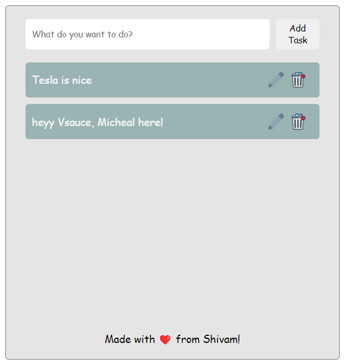
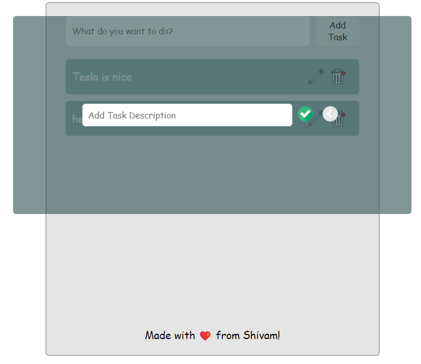

# Task Tracker - React App

Task Tracker is a React-based frontend application that interacts with an [Express-based REST API](https://github.com/singh-shivam789/task-tracker-server) to manage tasks. This app allows users to view, modify, and delete tasks with a simple and intuitive UI.


## Features
- Fetch and display all tasks on page load
- Modify tasks by clicking on the "pencil" icon
- Delete tasks with a "delete" button
- Communicates with an Express server for task data management

## Technologies
- **React**: Frontend UI
- **Vite**: Development tool for fast build and live reload
- **Express**: Backend API for managing tasks
- **CSS**: Styling

## Setup Instructions

1. Clone the repository:
   ```bash
   git clone https://github.com/singh-shivam789/task-tracker-client
   cd task-tracker
   ```

2. Install frontend dependencies:
   ```bash
   npm install
   ```

3. Start the React development server:
   ```bash
   npm run dev
   ```
   This will start the app on `http://localhost:5173`.

4. Make sure the Express server is running (on `http://localhost:3000`) to handle API requests.

## Functionality

- **Fetching Tasks**: On initial load, the app makes a GET request to the backend (`GET /`) to fetch all tasks.
  
- **Modify Task**: Click on the "pencil" icon next to any task to reveal an editable element that allows you to modify the task name or details. Submit the changes to update the task on the server.

- **Delete Task**: Click on the "delete" button next to any task to remove it from the list. This will send a DELETE request to the backend.


## Contributions
Contributions are not welcome! 
